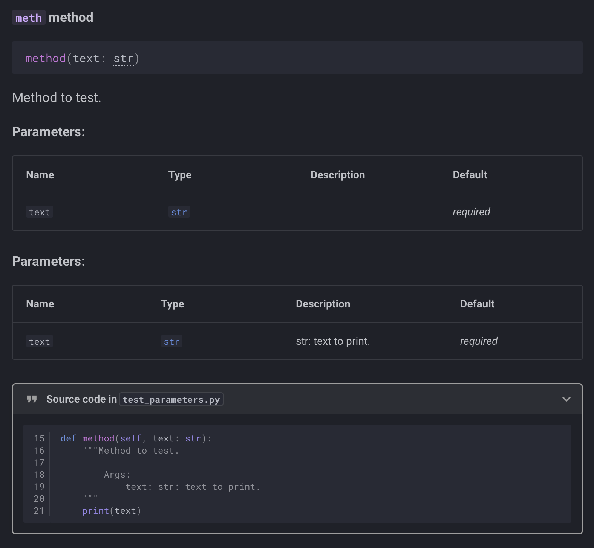
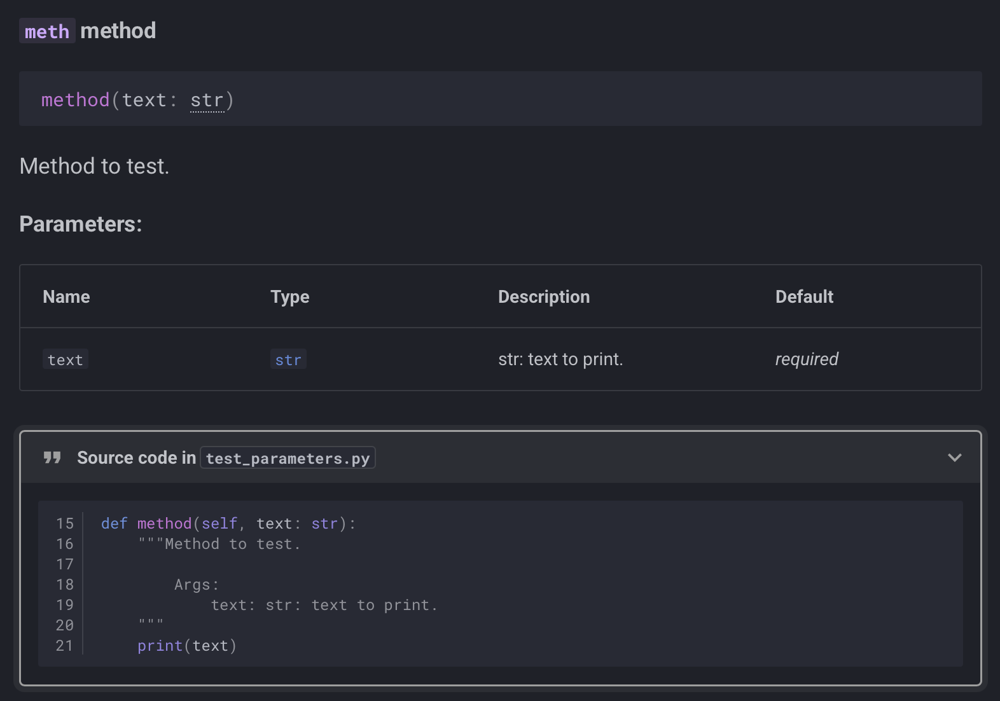

# griffe-typingdoc repro

## Duplicated Parameter section

When enabling griffe-typingdoc, the parameters section for functions is repeated if you are documenting the parameter in the normal docstring, even if you don't annotate your parameters with a [pep 727 docstring][typing.Doc].

### Screenshots
griffe-typingdoc Enabled:

```yml
plugins:
  - mkdocstrings:
      handlers:
        python:
          options:
            extensions:
              - griffe_typingdoc
```



griffe-typingdoc Disabled:

```yml
plugins:
  - mkdocstrings:
      handlers:
        python:
          options:
            ...
```




### Current rendered API docs

::: test_parameters

## pep 727 documented module attributes


!!! note

    I was trying to create a TypeAlias, and as per [pep 727](https://peps.python.org/pep-0727/#transferring-documentation-from-type-aliases) this functionality was rejected. So this is NOT a bug.

[ChecksumString][test_attributes.ChecksumString] has a pep 727 doc string embedded in typing_extensions.Doc, which does not correctly get extracted.

[ChecksumString2][test_attributes.ChecksumString2] has a normal doc string embedded in typing_extensions.Doc, which does get correctly extracted.

[NormalString][test_attributes.NormalString] is an attempt to see if the addition Pydantic StringConstraint annotation interferes somehow, which it doesn't.

[hi][test_attributes.hi] is a function which has a parameter that is annotated pep 727 style, and which does work, which confirms griffe-typingdoc is active and functioning.

[hi_no_docstring][test_attributes.hi_no_docstring] is the same as [hi][test_attributes.hi], except it is not documented with a docstring. This is to test if the parent object needs a docstring before griffe-typingdoc kicks in, but that's not the case as the parameter is still handled correctly.

::: test_attributes

